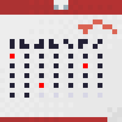

## Home

Choose a slot, book it, be organized! 

WIP -> must be connected to an API
## Local

Clone the repo, and `yarn && yarn start`

To build it, `yarn build`

And to serve the build in local, `yarn serve` (must have `serve` installed on your system)

#

